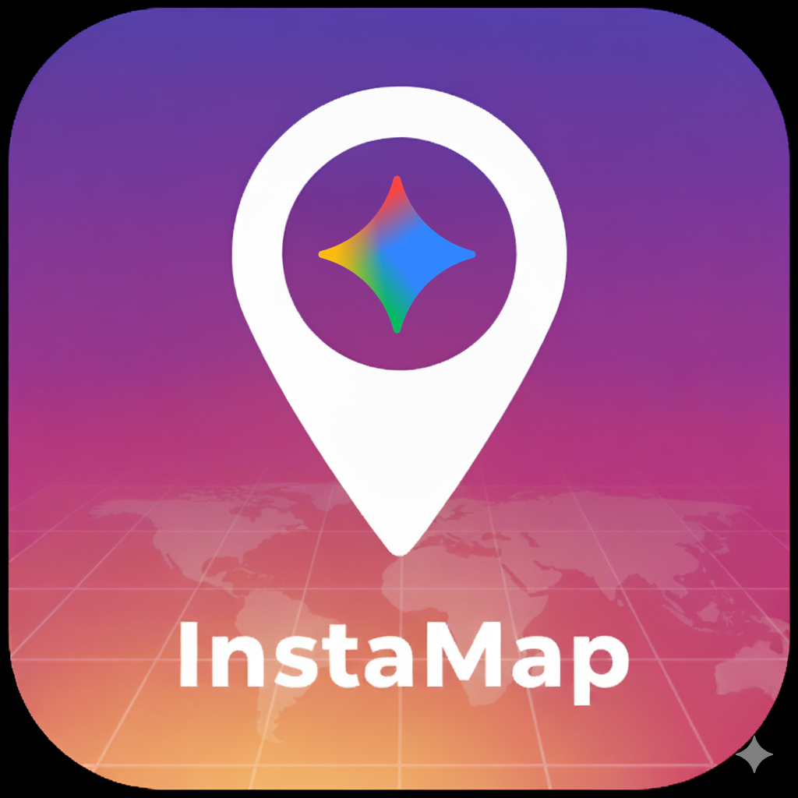
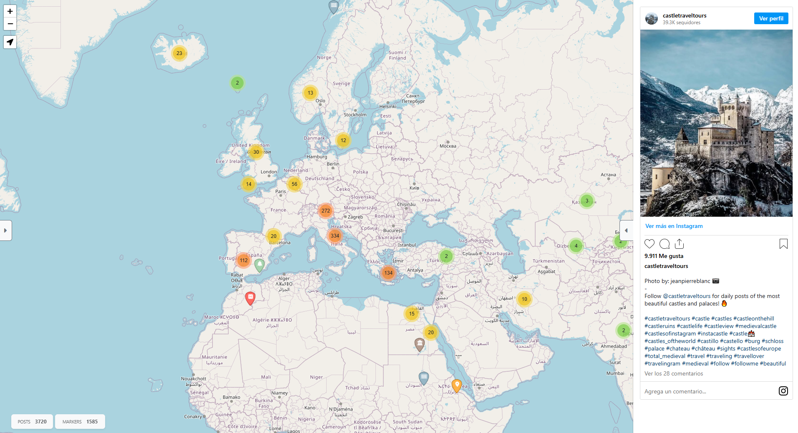

# InstaMap — Visualize Instagram Posts on a Map

<!--  -->


---

**InstaMap** is an automated tool that downloads your saved Instagram 
posts using **[gallery-dl](https://github.com/mikf/gallery-dl)**, extracts 
their metadata, and displays them on an interactive **Leaflet** map.
Each post is embedded directly on the map at its corresponding location, 
allowing you to explore your saved content geographically.  

The project also uses **Gemini** (Google’s generative AI) to analyze post 
captions and identify additional locations mentioned in the text — adding 
extra context and depth to your map.  

All steps — from downloading posts to generating and deploying the 
interactive map — are almost fully automated via **GitHub Actions**.  



---

## 🚀 Features  

* **Automated Post Downloading:** Uses `gallery-dl` to download your saved Instagram posts.
* **Geolocation Extraction:** Parses metadata for existing location data.
* **AI-Powered Location Finding:** Uses the **Gemini AI** API to find *additional* locations mentioned in post captions.
* **Interactive Map:** Generates a beautiful, interactive **Leaflet** map to display your posts.
* **Fully Automated:** Runs on a schedule using **GitHub Actions**—no local setup required.
* **Secure:** Uses GitHub Secrets to securely store your Instagram and API keys.
 
---

## 🔐 Getting Started

Follow these steps to get your own version of InstaMap running.

### Step 1: Fork the Repository

Click the **"Fork"** button at the top right of this page to create your own 
copy of the project.

### Step 2: Add Repository Secrets

This project requires two secrets to run. Go to your forked repo's 
**Settings** > **Secrets and variables** > **Actions** and click 
**New repository secret** for each of the following:

#### 1. `IG_COOKIE_64` (Your Instagram Session)

This is required to let `gallery-dl` download your private saved posts. 
This process is manual and must be repeated every few weeks when your 
cookie expires.

1.  **Install a Cookie Exporter:** We recommend [Get cookies.txt LOCALLY](https://chromewebstore.google.com/detail/get-cookiestxt-locally/cclelndahbckbenkjhflpdbgdldlbecc) (Chrome/Edge) or [cookies.txt](https://addons.mozilla.org/en-US/firefox/addon/cookies-txt/) (Firefox).
2.  **Export Cookies:** Log in to [instagram.com](https://www.instagram.com) and click the extension icon to download the `cookies.txt` file.
3.  **Convert to Base64:** To store the cookie securely, you must convert it to a Base64 string. Open a terminal and run the correct command for your OS:
    * **macOS / Linux:**
        ```bash
        base64 cookies.txt
        ```
    * **Windows (PowerShell):**
        ```powershell
        [Convert]::ToBase64String([IO.File]::ReadAllBytes("cookies.txt"))
        ```
4.  **Add Secret:** Copy the single, long string output. Create a new secret named `IG_COOKIE_64` and paste the string into the **Value** field.

#### 2. `GOOGLE_API_KEY` (Your Gemini AI Key)

This is used to find locations in your post captions.

1.  **Get Key:** Go to [Google AI Studio](https://aistudio.google.com/app/apikey) and click "**Create API key**".
2.  **Add Secret:** Create a new secret named `GOOGLE_API_KEY` and paste your key into the **Value** field.


### Step 3: Run the Workflow

1.  Go to the **Actions** tab in your forked repository.
2.  In the left sidebar, click the **"Build and Deploy Map"** workflow.
3.  Click the **"Run workflow"** dropdown, select the `main` branch, and click the green **"Run workflow"** button.
4.  Wait for the action to complete. It will download your posts, build the map, and push the final files to a new `gh-pages` branch.

> **Important:** Remember to edit the `.github/workflows/deploy-page.yml` file and change the default Instagram URL (e.g., `https://www.instagram.com/bernardhp/saved/`) to point to your own account.

### Step 4: Enable GitHub Pages

1.  Go to your repo's **Settings** > **Pages**.
2.  Under "Build and deployment," set the **Source** to **"Deploy from a branch"**.
3.  Set the **Branch** to `gh-pages` and the folder to `/(root)`.
4.  Click **Save**.

That's it! Your map will be live at `https://<your-username>.github.io/<your-repo-name>/` in a few minutes. 
The GitHub Action will automatically run on its schedule to keep your map updated 
with new saved posts.

## 🗺️ How to Import KML into Google Maps

1.  Generate your map on Instamap.
2.  Open the left side panel and click the  **"Export to Google Maps"** button to save the `.kml` file. 
3.  Go to [Google My Maps](https://www.google.com/mymaps).
4.  Click the **"+ Create a New Map"** button.
5.  In the top-left panel (under "Untitled layer"), click the **"Import"** link.
6.  Select the `.kml` file you just downloaded from your computer.
7.  Your map, with all its custom icons and data, will be loaded and displayed.
8.  It will also be available on your Google Maps App!


#### 3.1 Custom Icon Generation

A significant limitation of Google My Maps' KML importer is that it **ignores most KML styling 
tags**, including `<color>` and references to default icons. While the KML standard supports 
these features, Google Maps will not render them, resulting in all placemarks reverting to a 
default pin.

The *only* reliable method to customize placemark icons in Google My Maps is to use image URLs.

This project's workflow is built around this limitation. We do not use default pins. Instead, 
we use a custom script to generate unique PNG icons for every placemark type. These generated 
icons are hosted in this repository (in `web/static/img/markers/`), allowing them to be 
publicly accessed via GitHub. The KML export function is then configured to point directly to 
these public image URLs (e.g., `...github.io/.../static/img/markers/village.png`), which Google
 Maps can correctly load.

#### 3.2 How to Generate the Icons

The icons are created using a standalone browser tool included in this repository.

1.  **Generator:** Open the `web/generate_icons.html` file in your local browser.
2.  **Configuration:** The tool reads its configuration from the `MARKER_STYLE` object in `settings.js`.
3.  **Export:** When you click the button, the tool uses the Font Awesome font to draw the configured icons onto an HTML canvas and downloads them as individual PNG files, bundled into a `markers.zip`.
4.  **Storage:** You must unzip this file and upload the new or updated PNG icons to the `web/static/img/markers/` directory in this repository and commit the changes.

#### 3.3 Important Notes & Troubleshooting

* **Unicode is Required:** For the `web/generate_icons.html` generator to work, each entry in the `MARKER_STYLE` object *must* have a `unicode` property (e.g., `unicode: '\uf51d'`). This is the unique code for the Font Awesome icon.
* **"Some Icons Are Not Working" (Fix):** If you see a blank icon or a default circle in your generated PNGs, it means the `unicode` property for that type in `settings.js` is either **missing or incorrect**. To fix it:
    1.  Find the icon you want on the [Font Awesome 6](https://fontawesome.com/icons) website.
    2.  Click the icon to see its details.
    3.  Copy its Unicode value (e.g., `f51d`).
    4.  Add it to the `MARKER_STYLE` object in `settings.js`, like `unicode: '\uf51d'`.

---


## 💻 Running Locally (Optional)

If you prefer to run the data extraction process on your local machine you can use the `run.sh` script.

This is useful for testing or if you want to manually generate the map data.

1.  **Provide Cookies:** The `run.sh` script by default looks for a `cookies.txt` file in 
    the root directory. **Alternatively,** you can edit `run.sh` and change the `gallery-dl` 
    command to use the `--cookies-from-browser <browser_name>` flag (e.g., `--cookies-from-browser firefox`) 
    to extract cookies directly from your logged-in browser session.

2.  **Set API Key:** The Python scripts will look for your Gemini API key. You must set it as an environment variable in your terminal:
    ```bash
    export GOOGLE_API_KEY="your_api_key_goes_here"
    ```
3.  **Run the Script:** First, make the script executable (you only need to do this once), then run it.
    ```bash
    chmod +x run.sh
    ./run.sh
    ```

This will run the same `gallery-dl` and Python scripts that the GitHub Action uses, updating your local data.


## 1. Data Download & Filtering (gallery-dl)

The core archival tool is `gallery-dl`, executed on a scheduled basis. 

> ⚠ **Note:** The browser needs to be closed for the cookie extraction to work properly.

> ⚠ **Note:** It seems that automatic cookie extraction does not work for chrome

**Initial/Manual Download Commands:**

| Target | Command | Notes | 
|  ----- | ----- | ----- | 
| **Instagram Saves** (Specific User) | `$ gallery-dl -v "https://www.instagram.com/bernardhp/saved/" --cookies-from-browser firefox --write-metadata --filter "date >= datetime(YYYY, MM, DD) or abort()"` | Uses Firefox, includes date filtering, and writes comprehensive metadata (`.json`). | 
| **Twitter Media** | `$ gallery-dl https://twitter.com/username/media --filter "date >= datetime(2025, 9, 28) or abort()"` | Downloads all media from a user's timeline, filtered by date. | 
| **Instagram Saves** (Archiving setup) | `$ gallery-dl -v "https://www.instagram.com/bernardhp/saved/" --cookies-from-browser chrome --write-metadata -o extractor.archive='./gallery-dl/archive.sqlite3'` | Sets up the archive database to only download new content on subsequent runs. | 


## 2. Post-Processing and Data Enrichment

Once media files and initial metadata are downloaded, Python scripts execute 
tasks to clean, enrich, and merge the data.

### Step 2.1: Create Caption Files

This step converts the full caption data contained within the raw `.json` 
metadata into separate, easily readable text files (e.g., `post_shortcode/caption.txt`).

**Command:**
`$ python create_caption_files.py`

### Step 2.2: Extract Locations using Gemini API

This crucial step leverages the Gemini API's intelligence capabilities 
to analyze post text and/or images, identifying, extracting, and standardizing 
geographical locations.

**Command:**
`$ python extract_locations_gemini.py`

### Step 2.3: Merge Metadata

This step combines the raw `gallery-dl` metadata with the newly extracted 
location data from the Gemini script, creating a unified, enriched master 
metadata file.

**Command:**
`$ python merge_metadata.py`

### Step 2.4: Convert Data for Web Visualization

The final enriched data is converted from its current format (e.g., JSON) 
into a JavaScript-compatible file format (e.g., a `.js` file with an array 
variable) for easy loading and plotting on a Leaflet web map.

**Command:**
`$ python convert_json2js.py`


